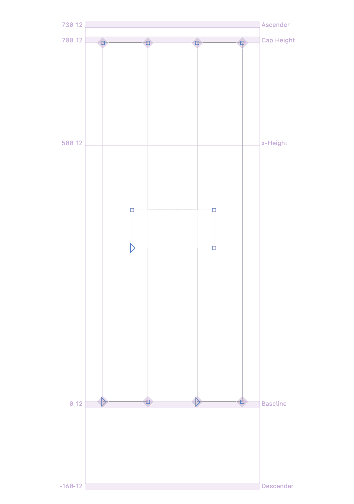

# Show-Alignment-Zone-Sizes
Glyphs 3 Reporter plugin to show Alignment Zone sizes in Edit View. Useful for flipping through masters and checking inconsistencies. Activate in the View menu, or add to Reporter Toggler.

